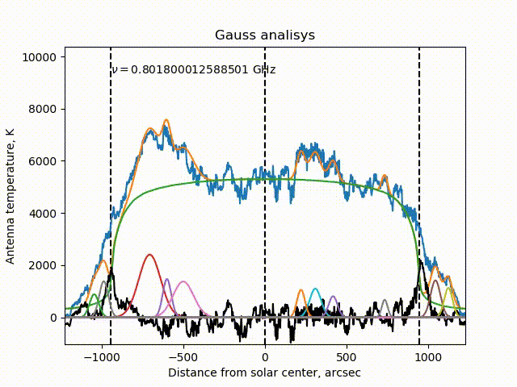
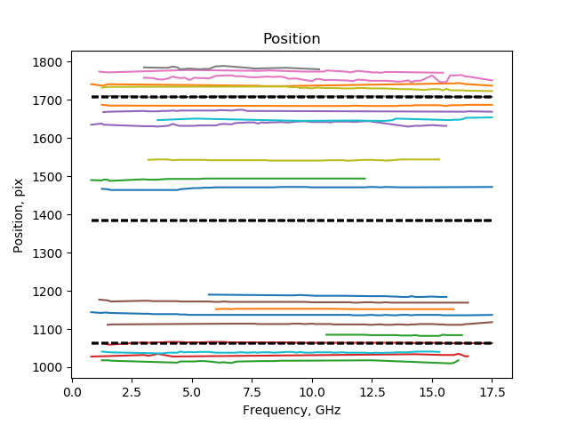
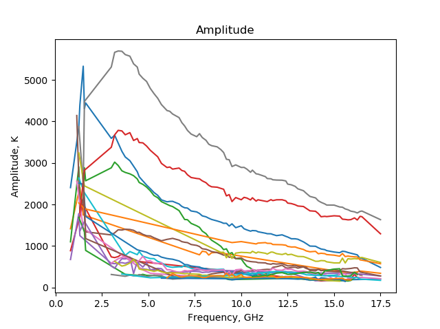
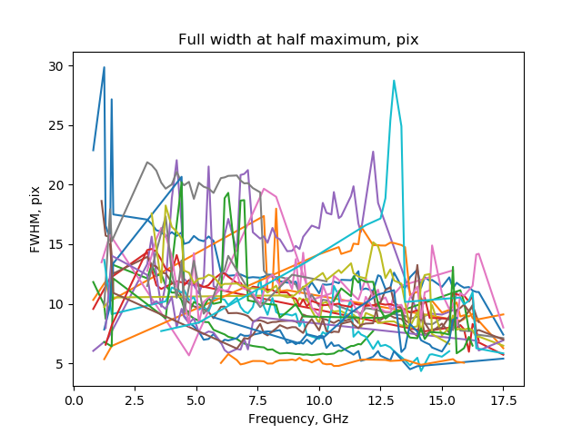
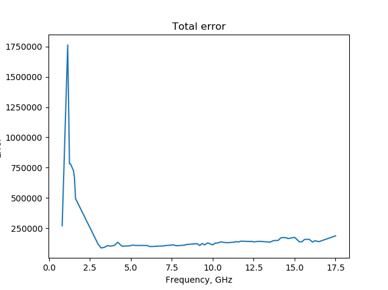

# RATAN-600
Автоматический гаусс анализ

* Описание алгоритма:

```{r, tidy=FALSE, eval=FALSE, highlight=FALSE }
Required: 
    data - одномерный скан,
    template – шаблон спокойного Солнца
    num_gauss – оценочное число гауссиан
Out: 
    gauss_param – параметры гауссиан

def get_gaussian_parameters(Data, Template, num_gauss)
    # Нулевое приближение: шаблон масштабируется так, чтобы суммарная разница была минимальной 
    coef = LeastSQ(data, template)
    # Скан за вычетом спокойного солнца
    dif = data – coef * template
    # Гауссианы вписываются пока не вознукнут исключения
    for i in range(num_gauss):
        # Вписываются последовательно i гауссиан
        for j in range(i):
            try:
                gauss_param[j] = add_gauss(dif)
                dif -= gauss_param[j]
            except:
                return gauss_param
            # Последующие приближения: шаблон масштабируется так, чтобы суммарная разница была минимальной
                coef = LeastSQ(data, template, gauss_param)
            # Скан за вычетом спокойного солнца
                dif = data – coef * template – gauss_layer(gauss_param)
        coef = LeastSQ(data, template, gauss_param)
        dif = data – coef * template
    return gauss_param

* функция LeastSQ подбирает коэффициент масштабирующий шаблон спокойного Солнца так, чтобы разница со сканом и вписанными гауссианами была наименьшей
** функция add_gauss вписывает одну гауссиану, в качестве максимума гауссианы она берет максимальное значение массива dif
```

* Пример работы:

Визуализация
Синяя кривая - скан, оранжевая - спокойное солнце плюс источники излучения, черная - разница (ошибка алгоритма), источники показаны снизу разными цветами.



Спектры гауссиан





Суммарная ошибка


